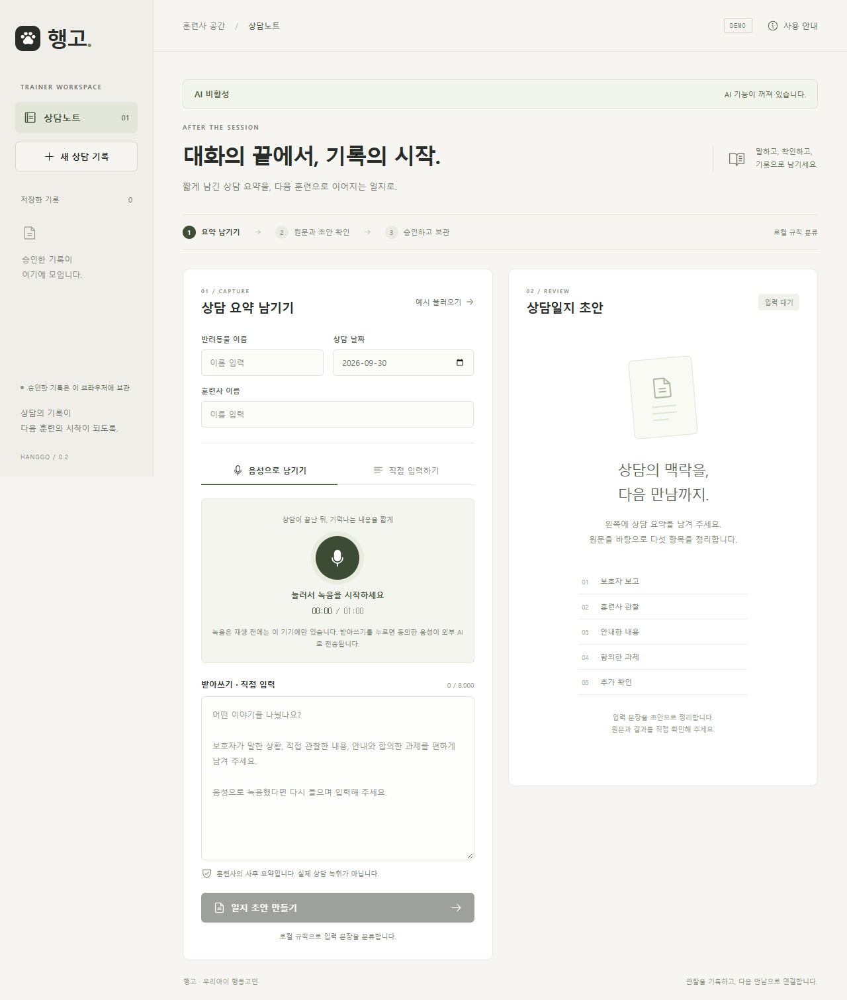
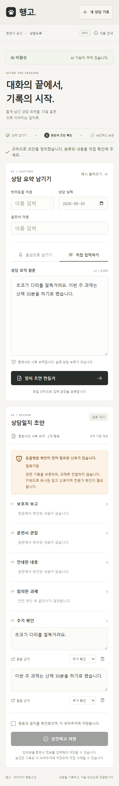

<div align="center">

# 행고 · Hanggo

### 대화의 끝에서, 기록의 시작.

보호자의 일상 기록부터 상담일지와 보호소 프로필까지, 원문 근거로 연결합니다.

[](https://github.com/joon56/Hanggo-LLM/actions/workflows/ci.yml)


[공개 체험판](https://joon56.github.io/Hanggo-LLM/) · [빠른 시작](#빠른-시작) · [15분 시연 대본](docs/testing/beta-test-script.md) · [테스트 가이드](docs/testing/manual-testing.md)

</div>



## 무엇을 할 수 있나요?

행고는 이 PC에서 Ollama `qwen3.5:9b`로 기록 초안을 만들고 Whisper medium으로 한국어 음성을 받아씁니다. 초안은 원문 근거와 함께 사람이 검토합니다. 승인한 기록은 접속한 브라우저의 `localStorage`에 저장합니다.

| 기능 | 흐름 |
|---|---|
| 상담일지 | 3~60초 음성 또는 8,000자 이하 텍스트 → 원문·분류·숫자 확인 → 승인·저장 |
| 보호자 일상 기록 | 반려동물 등록 → 음성 또는 텍스트 → 사건별 반려동물·시각·근거 확인 → 저장 |
| 상담 전 브리핑 | 같은 브라우저에 저장된 보호자 기록 → 최근 14일 사실표·근거·자료 부족 표시 |
| 보호소 프로필 | 날짜·작성자 역할이 있는 관찰 메모 → 긍정·주의 관찰 확인 → 담당자 확정 |

실제 레슨 카탈로그가 연결된 경우에만 레슨 후보가 표시됩니다. 빈 카탈로그에서 추천을 만들어 내지 않습니다. 브리핑도 기록이 부족하면 변화 판단을 생략합니다. 사용자별 계정·권한, 공유 저장소, 보호자 자동 전송, 상담 전체 녹취는 제공하지 않습니다.

<details>
<summary><strong>모바일 검토 화면 보기</strong></summary>
<br>

</details>

**[공개 체험판 열기 →](https://joon56.github.io/Hanggo-LLM/)**

GitHub Pages는 정적 체험판입니다. 텍스트 정리·녹음 재생·검토·브라우저 저장을 체험할 수 있지만 AI 생성과 받아쓰기는 없습니다. 회의에서 실제 AI를 시연할 때는 아래 **로컬 주소**를 사용하세요.

## 빠른 시작

Windows에서 Node.js 24, Ollama 0.34.4 이상, FFmpeg와 ffprobe가 필요합니다. 첫 설치에는 인터넷 다운로드와 디스크 여유가 필요합니다. 권장 확인 환경은 RTX 4060 8GB와 RAM 32GB입니다.

```powershell
powershell -ExecutionPolicy Bypass -File scripts/setup.ps1
npm.cmd run local:check
npm.cmd run dev:local
```

`setup.ps1`은 npm 설치와 로컬 모델 설치를 진행합니다. 이미 설치했다면 `npm.cmd run local:configure`와 `npm.cmd run local:check`로 설정을 확인할 수 있습니다. `dev:local`은 화면 `http://127.0.0.1:5173/`와 API `127.0.0.1:3001`을 이 PC에 엽니다. 종료는 Ctrl+C입니다. 브라우저 저장 기록을 다시 찾으려면 같은 브라우저 프로필과 같은 `127.0.0.1` 주소를 사용하세요.

회의 전 상태 점검:

```powershell
npm.cmd run beta:check
npm.cmd run beta:check -- --warmup
```

첫 명령은 준비 상태만 확인합니다. `--warmup`은 가상 상담 문장으로 로컬 HTTP 요청 1회를 보내 모델을 준비시키며 일일 요청 한도 1회를 사용합니다. 브라우저 기록은 저장하지 않습니다. [로컬 설치·설정](docs/testing/local-ai.md) · [음성 실행기](docs/testing/local-speech.md) · [15분 시연](docs/testing/beta-test-script.md)

## 사용 흐름과 확인

1. 가상 반려동물·훈련사 이름을 사용합니다. 회의 화면 공유에 입력 내용이 보일 수 있습니다.
2. 텍스트를 입력하거나 3~60초 녹음하고 재생합니다. 음성은 받아쓰기 뒤 이름·숫자·행동을 직접 확인합니다.
3. 화면의 로컬 AI 처리 확인란을 선택하고 초안을 만듭니다.
4. 원문 근거와 분류를 확인합니다. 승인·검토 확인란을 선택한 뒤 브라우저에 저장합니다.
5. 새로고침 뒤 저장 목록에서 다시 열고 JSON으로 내보낼 수 있습니다. 삭제는 확인 후 진행합니다.

AI 요청 실패·검증 실패 때 원문을 유지하고 수동 검토 초안을 표시할 수 있습니다. 이 경우 AI 성공으로 기록하지 않습니다. 개인정보 패턴 일부는 텍스트 요청 전에 가리지만 모든 항목을 찾지는 못합니다. 음성은 받아쓰기 요청 때 이 PC의 로컬 서버에서 처리됩니다. 서버는 요청용 임시 파일을 처리 후 삭제합니다. 브라우저 저장 자료는 자동 백업·기기 간 동기화되지 않으며 JSON은 내보내기만 지원합니다.

## 검증

```powershell
npm.cmd run verify
npm.cmd run llm:eval:local
npm.cmd run llm:eval:local -- --all
npm.cmd run llm:eval -- --live --case N01
npm.cmd run llm:eval:workspace -- --feature owner --case bark-delivery --live
```

`verify`는 단위·빌드·모의 브라우저 테스트와 자료 형식 평가를 실행합니다. `llm:eval:local`과 `--live`는 로컬 모델 평가입니다. 전체 평가는 오래 걸릴 수 있습니다. 음성 평가는 `--audio-dir test-audio`와 사례 ID에 맞는 WAV/WebM/MP4/MP3 파일이 필요합니다. 결과 JSON에는 가상 원문을 사용하세요.

이번 로컬 전환에서는 단위 테스트 259개, 모의 브라우저 테스트 10개, 빌드·타입 검사와 82개 테스트 자료 검사가 통과했습니다. 이전 실모델 측정에서 `qwen3.5:9b` 전체 사례는 74/82개 자동 조건을 통과했습니다. 같은 16개 사례 비교에서는 이전 모델 6/16개, 현재 모델 15/16개였습니다. 실모델 수치는 당시 환경의 측정값이며 모든 입력에 대한 품질 보장은 아닙니다. [이번 베타 검증 기록](docs/llm/beta-verification.md) · [이전 로컬 모델 검증](docs/llm/local-verification.md) · [과거 외부 AI 실험](docs/llm/openai-verification.md)

## 실행 범위

로컬 실행은 Ollama와 Whisper만 사용합니다. 설정에는 `AI_ENABLED`, 기능별 `FEATURE_*_ENABLED`, `OLLAMA_*`, `WHISPER_*`가 있습니다. 기본 텍스트 모델은 `qwen3.5:9b`, 음성 모델은 Whisper medium Q5_0입니다. 모델을 바꾸면 실제 평가를 다시 수행하세요. `LESSON_CATALOG_PATH`가 비어 있으면 레슨 후보가 없습니다.

공개 GitHub Pages는 AI 없는 정적 체험판으로 유지됩니다. 로컬 빌드 확인은 `npm.cmd run build` 뒤 `npm.cmd start`로 할 수 있습니다. 외부 호스팅은 현재 로컬 Ollama·Whisper 실행 경로가 아니므로 회의 AI 시연에 사용하지 않습니다. [실행·배포 범위](docs/testing/deployment.md) · [기능별 테스트](docs/testing/workspace-testing.md)

---

<div align="center"><strong>말하고, 확인하고, 기록으로 남기세요.</strong><br>행고 · 우리아이 행동고민</div>
